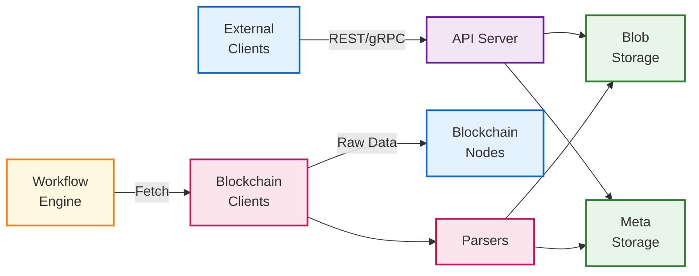
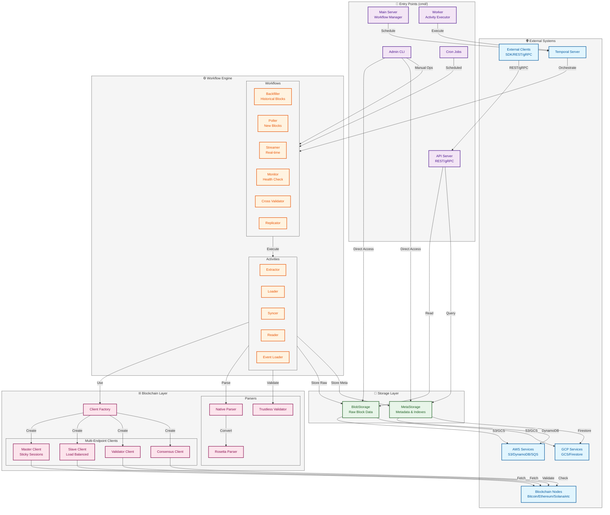
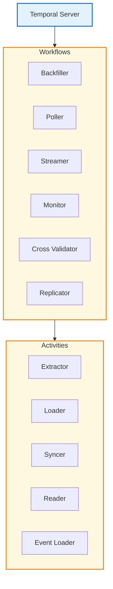
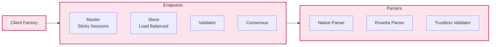
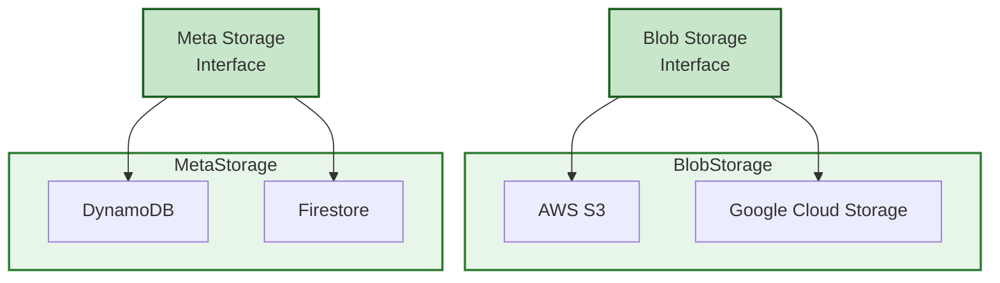

# ChainStorage Component Diagram

## Overview

ChainStorage is a distributed blockchain data storage and processing system that continuously replicates blockchain data and serves it through APIs.

## High-Level Architecture (Simplified)



## Detailed Architecture



## Component Breakdown

### Workflow Engine Detail



### Blockchain Client Architecture



### Storage Architecture



## Component Details

### Entry Points

1. **API Server** (`cmd/api`)
   - Serves REST and gRPC endpoints
   - Provides block data, events, and metadata
   - Handles authentication and rate limiting

2. **Main Server** (`cmd/server`)
   - Manages Temporal workflows
   - Coordinates blockchain data ingestion
   - Handles workflow scheduling

3. **Worker** (`cmd/worker`)
   - Executes Temporal activities
   - Performs actual blockchain data fetching
   - Handles parsing and validation

4. **Admin CLI** (`cmd/admin`)
   - Manual workflow management
   - Direct storage operations
   - Debugging and maintenance

5. **Cron** (`cmd/cron`)
   - Scheduled maintenance tasks
   - Periodic health checks
   - Cleanup operations

### Storage Layer

1. **BlobStorage**
   - Stores compressed raw block data
   - Supports S3 (AWS) and GCS (GCP)
   - Provides presigned URLs for direct access
   - Handles block versioning

2. **MetaStorage**
   - Stores block metadata (height, hash, timestamp)
   - Maintains transaction indexes
   - Tracks events (block added/removed)
   - Supports DynamoDB (AWS) and Firestore (GCP)

### Blockchain Layer

1. **Client System**
   - **Master**: Primary endpoint with sticky sessions
   - **Slave**: Load-balanced endpoints for ingestion
   - **Validator**: Data validation endpoints
   - **Consensus**: Consensus verification endpoints

2. **Parser System**
   - **Native Parser**: Blockchain-specific parsing
   - **Rosetta Parser**: Standardized Rosetta format
   - **Trustless Validator**: Cryptographic validation

### Workflow Engine

1. **Core Workflows**
   - **Backfiller**: Historical block ingestion
   - **Poller**: Continuous new block polling
   - **Streamer**: Real-time block streaming
   - **Monitor**: System health monitoring
   - **Cross Validator**: Cross-chain validation
   - **Replicator**: Data replication

2. **Activities**
   - **Extractor**: Fetches raw blocks
   - **Loader**: Stores processed blocks
   - **Syncer**: Synchronizes blockchain state
   - **Reader**: Reads stored data
   - **Event Loader**: Processes blockchain events

## Data Flow

1. **Ingestion Flow**
   ```
   Blockchain Node → Client → Parser → Validator → Storage
   ```

2. **Query Flow**
   ```
   External Client → API Server → Storage → Response
   ```

3. **Workflow Flow**
   ```
   Temporal → Workflow → Activity → Client → Blockchain
                    ↓
                Storage
   ```

## Key Design Patterns

- **Factory Pattern**: Dynamic blockchain client/parser creation
- **Interceptor Pattern**: Request/response instrumentation
- **Module Pattern**: Clean separation of concerns
- **Dependency Injection**: Using Uber FX framework
- **Option Pattern**: Flexible configuration

## Supported Blockchains

- **EVM**: Ethereum, Polygon, BSC, Arbitrum, Optimism, Base, Fantom, Avalanche
- **Bitcoin-based**: Bitcoin, Bitcoin Cash, Dogecoin, Litecoin
- **Others**: Solana, Aptos, Tron
- **Special**: Ethereum Beacon Chain

## Scalability Features

- Horizontal scaling via distributed storage
- Multi-endpoint load balancing
- Temporal workflow orchestration
- Configurable batch processing
- Support for 1,500+ blocks/second